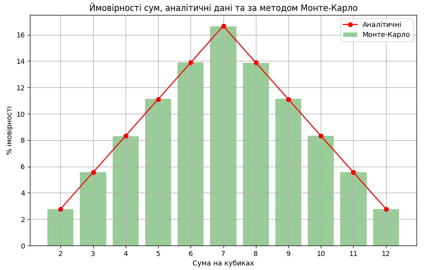

# Використання методу Монте-Карло

   - Виконується 1 000 000 кидків двох кубиків.
   - Підраховується кількість кожної можливої суми (від 2 до 12).
   - Обчислюються ймовірності кожної суми на основі підрахованих даних.

## Результати

### Таблиця результатів

| Сума | Монте-Карло (%) | Аналітична (%) |
|------|-----------------|----------------|
| 2    | 2.79            | 2.78           |
| 3    | 5.58            | 5.56           |
| 4    | 8.27            | 8.33           |
| 5    | 11.09           | 11.11          |
| 6    | 13.92           | 13.89          |
| 7    | 16.65           | 16.67          |
| 8    | 13.93           | 13.89          |
| 9    | 11.11           | 11.11          |
| 10   | 8.32            | 8.33           |
| 11   | 5.55            | 5.56           |
| 12   | 2.79            | 2.78           |

### Графік результатів

## Висновки

1. **Співпадіння результатів**:
   - Результати симуляції методом Монте-Карло дуже близькі до аналітичних значень. Відхилення між ними мінімальні, що вказує на високу точність симуляції.
   
2. **Розподіл ймовірностей**:
   - Як видно з графіку, розподіл ймовірностей для обох методів є практично однаковим. Піки ймовірностей знаходяться на тих самих значеннях сум.

3. **Достовірність моделі**:
   - Дані симуляції методом Монте-Карло підтверджують теоретичні розрахунки, що доводить правильність моделі.

Результати симуляції методом Монте-Карло підтверджують теоретичні розрахунки ймовірностей сум при киданні двох кубиків, що вказує на правильність як самого методу, так і обчислень.